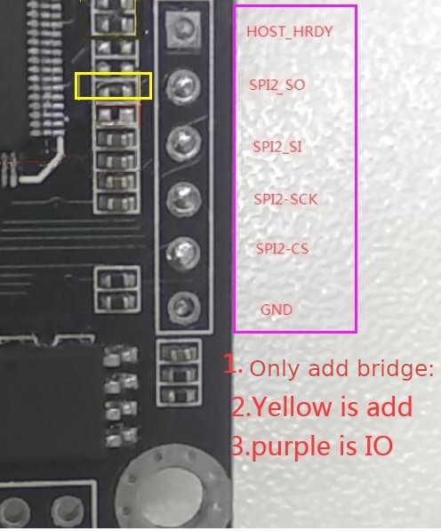

# Cinread-IT8951 HAT

Hardware repository for the Cinread.com HAT for 9.7 inch parallel epaper display sold by Good display. 

The goal of this HAT is to provide:

- WiFi
- BLE
- DS3231 real time clock
- Fast 40Mhz SPI
- 3V to 5V step-up
- 3.7v LiPo battery charger

## Hardware notices

Cinread early revisions that Goodisplay is selling need a small very tiny bridge in the resistances at the side of SPI. Also the Silkscreen has an error and SI is swapped by CLK.
Please refer to the following image to the correct SPI labels:



Important: I only tested this with one Cinread PCB but there are now 3 more coming. So it's possible that the SPI initial issue I had was mostly sticking to the wrong labels, sending SPI Clock via MOSI, which will of course never work. On the new ones that are coming I will try to send SPI data without making any hardware modifications and just using the right PINs.

## Ideas that could be added to the schematic

Provided by colleagues [Larry Bank](https://github.com/bitbank2) and [Lovyan03](https://github.com/lovyan03)

1) Increase the pull-up resistors from 2.2 to 4.7K. Safer if the external I2C device already has its own pullups. DONE
2) Add a voltage divider to measure the battery voltage. Something with one end connected to another GPIO to allow the current to be shut off completely when not needed. DONE
3) You might want to get a connector to connect a JTAG debugger. DONE

## ESP32-S3 Pin for JTAG

Referenced from this page in [Espressif documentation](https://docs.espressif.com/projects/esp-idf/en/latest/esp32s3/api-guides/jtag-debugging/configure-builtin-jtag.html)

	
```
GPIO19 D-

GPIO20 D+

5V -> V_BUS
```

This second USB will also enable DFU mode to flash the Microcontroller.

### Connection IOs used for preliminary tests

On my first tests to implement this using an Espressif ESP32-S3-WROOM-1U-N8R2 module with 2MB PSRAM I used the following GPIOs:

```
CONFIG_EINK_SPI_MOSI=11
CONFIG_EINK_SPI_MISO=12
CONFIG_EINK_SPI_CLK=13
CONFIG_EINK_SPI_CS=10
CONFIG_EINK_BUSY=3
```

Note: Reset PIN is not needed and it's also not in [Cinread PCB sold by Good display](https://www.good-display.com/product/425.html).

MISO pin should be connected and spi_3wire parameter for Lovyan GFX set to false, since it is in fact 4 wire SPI (CLK, MOSI, MISO)

This is using at the testing breadboard Lovyan GFX in their develop branch, since it reads the [mem_address to write the image from SPI](https://github.com/lovyan03/LovyanGFX/issues/242), hence using the master branch of the library it will not work or it will write the image incorrectly on the 9.7" display.


### Hardware requirements

- [DEXA-C097](https://www.good-display.com/product/425.html) PCB sold by Good-Display
- One ED097OC* or **ED097TC2 parallel epaper**, sold by Aliexpress, check more [9.7" details in EPDiy project](https://github.com/vroland/epdiy#join-the-discussion) supported epapers table
- This board that is still on production.

In case you want to test it earlier, please get a ESP32-S3-WROOM-1U-N8R2 and connect the 4 required SPI cables, plus 5V and GND making your own PCB.

### Firmware examples

Meet [epaper weather station](https://github.com/martinberlin/epaper-weather-station) first project featuring this hardware and our test PCB.


[Schematics](/Schematic/IT8951-S3-HAT-Schematic.pdf)

### Would you like an S2 budget version

If you are interested on having a more budget version of this controller I have an idea to step down fabrication price. Please check [Issue #1](https://github.com/martinberlin/H-cinread-it8951/issues/1) and use the thumb up or write a message to confirm that you are interested. Also take the time to think if there is any other cool addition that we can make to the S2 version.
